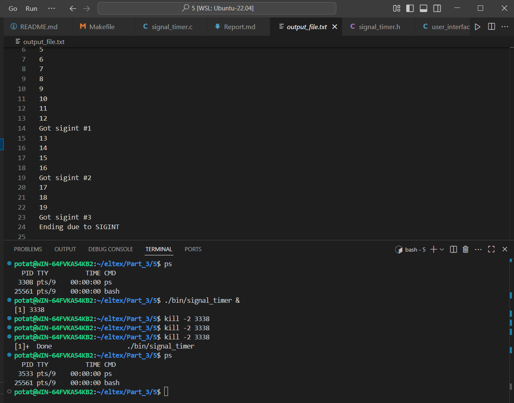
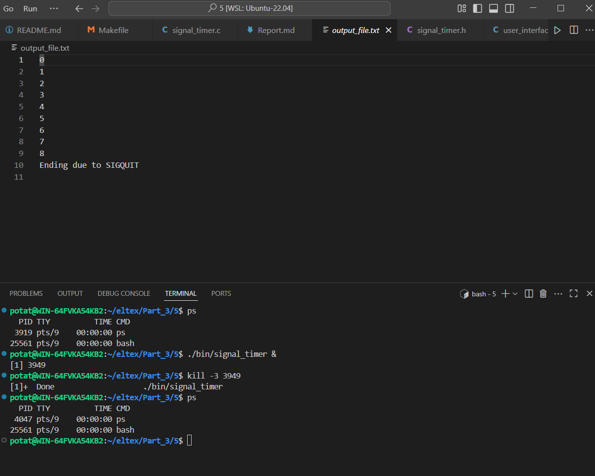
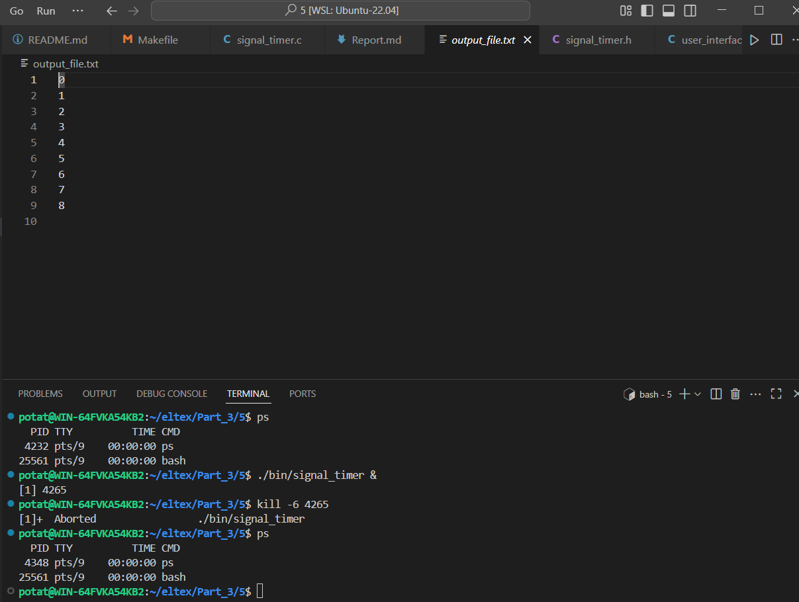
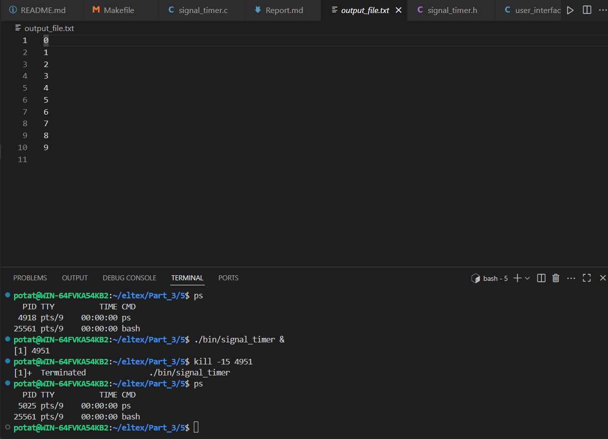
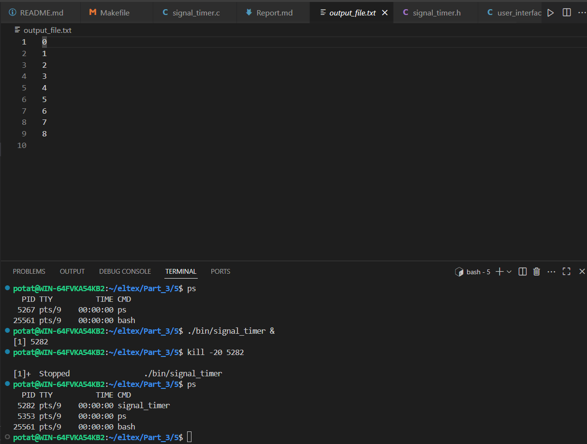
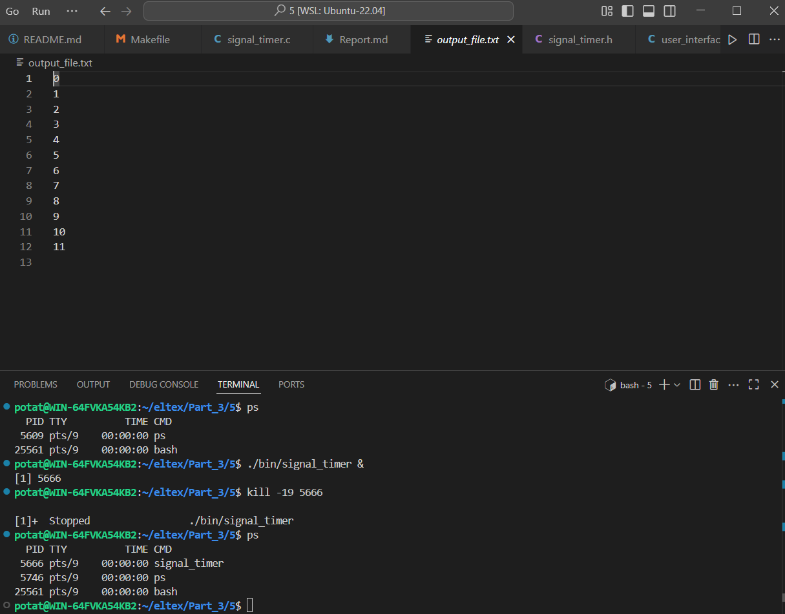
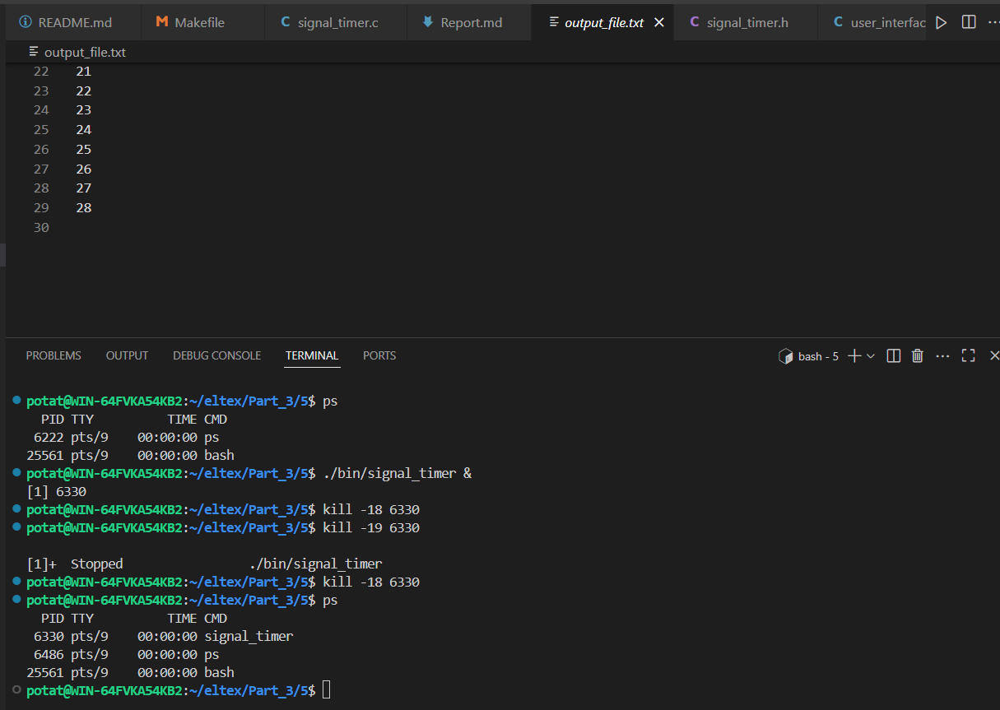

SIGINT (2) - сигнал прерывания выполнения программы, ожидается что программа при каждом получении этого сигнала будет писать об этом в файл, а после получения третьего завершит выполнение программы.

SIGQUIT (3) - сигнал завершения программы (вежливый, на случай если мы наткнулись на ошибку), ожидается что программа напишет о получении этого сигнала в файл, после чего завершится.

SIGABRT (6) - сигнал самоостановки, ожидается что программа завершится.

SIGKILL (9) - неперехватываемый сигнал завершения программы (грубый), ожидается что программа завершится.

SIGTERM (15) - сигнал завершения программы (вежливый), ожидается что программа завершится.

SIGTSTP (20) - перехватываемый сигнал приостановки, ожидается что программа приостановится, и её можно будет найти через ps.

SIGSTOP (19) - неперехватываемый сигнал приостановки, ожидается что программа приостановится, и её можно будет найти через ps

SIGCONT (18) - сигнал возобновления приостановленной программы, ожидается что программа возобновит работу, если была остановлена, иначе эффекта не будет.
