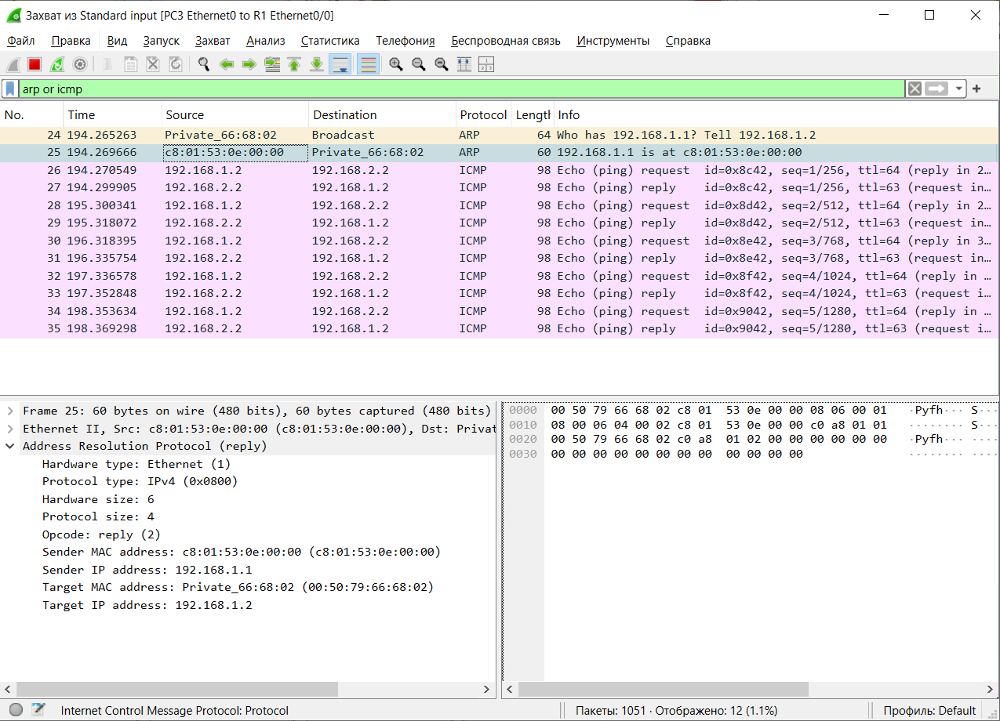

4) Перехватить трафик протокола arp на всех линках(nb!), задокументировать и проанализировать заголовки пакетов в программе Wireshark, 
	для фильтрации трафика, относящегося к указанному протоколу использовать фильтры Wireshark

Пакеты arp между первым компьютером и коммутатором

Пакеты arp между вторым компьютером и коммутатором

Пакет состоит из Ethernet II заголовка и ARP пакета. Ethernet заголовок содержит MAC адрес точки назначения и отправителя, а также тип протокола полезной нагрузки. В данном пакете точка назначения имеет широковещательный адрес. Адрес отправителя конкретный. Тип протокола полезной нагрузки указан как ARP.   
В ARP пакете заголовок содержит тип используемого канального протокола (Ethernet), тип сетевого протокола (IPv4), длину физического адреса, длину логического адреса, а также код операции отправителя (1 для запроса, 2 для ответа).  
Полезная нагрузка ARP пактеа содержит физический и логический адреса отправителя и цели.  
На обоих линках отправляемые и получаемые пакеты идентичны.

7) Перехватить трафик протокола arp и icmp на всех линках(nb!), задокументировать и проанализировать заголовки пакетов в программе Wireshark, 
	для фильтрации трафика, относящегося к указанному протоколу использовать фильтры Wireshark

Пакеты arp между первым компьютером и коммутатором

Пакеты arp между вторым компьютером и коммутатором

Несмотря на то, что 192.168.1.2 пингует 192.168.2.2, ARP запрос от 1.2 пытается узнать кому принадлежит IP 192.168.1.1, и то же самое с обратными пакетами. Первый и второй компьютеры узнают кому принадлежит IP коммутатора, после чего начинают отправлять ICMP пакеты. Почему-то первый ICMP пакет на втором линке приходит раньше ARP запроса, возможно это баг эмуляции, т.к. в этом первом пакете уже указан MAC адрес второго компьютера. В обоих ARP пакетах компьютеры связываются с коммутатором, но не друг с другом.

Пакеты icmp между первым компьютером и коммутатором

Пакеты icmp между вторым компьютером и коммутатором

Пакет состоит из Ethernet II заголовка, IPv4 заголовка и ICMP пакета.  
IPv4 заголовок содержит версию (4), длину заголовка, поле для различения трафика по классу обслуживания, полную длину пакета, идентификатор фрагментации, флаги, смещение фрагмента, время жизни пакета, тип протокола пакета (ICMP), контрольную сумму заголовка, логические адреса отправителя и точки назначения. Между линками отличие было лишь во времени жизни и контрольной сумме. Ответные пакеты отличаются адресами отправителя и точки назначения (просто наоборот).  
ICMP пакет содержит тип (0 - пинг ответ, 8 - пинг запрос), код (в данном случае равен 0, но может быть ненулевым для пакетов другого типа), контрольную сумму, идентификатор (одинаков для пары запрос-ответ), номер последовательности (какой по счёту ping пакет), и данные (что именно в них находится я найти не смог, но выглядит как просто 56 последовательных чисел от 8 до 3f). Содержимое пакета на обоих линках идентично.