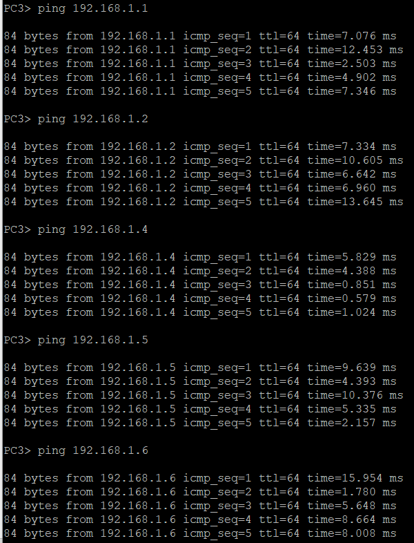
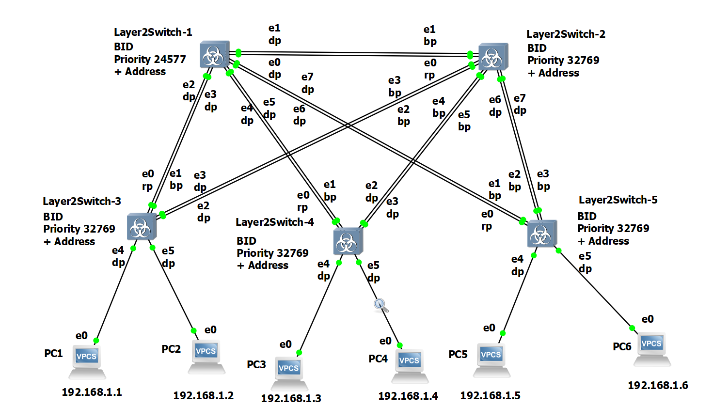

1) Для заданной на схеме schema-lab2 сети, состоящей из управляемых коммутаторов и персональных компьютеров
настроить протокол STP, назначив явно один из коммутаторов корневым настройкой приоритета

Сначала настраиваем ip на всех компьютерах  

Настраиваем spanning-tree на корневом коммутаторе  
vIOS-L2-01>enable    
vIOS-L2-01#conf t  
vIOS-L2-01(config)#spanning-tree vlan 1 root primary  

Проверяем настройку
vIOS-L2-01#show spanning-tree

2) Проверить доступность каждого с каждым всех персональных компьютеров (VPCS), результаты запротоколировать

PC1> ping 192.168.1.#  
Вместо # подставляется номер компьютера

3) На изображении схемы отметить BID каждого коммутатора и режимы работы портов (RP/DP/blocked) и стоимости маршрутов, результат сохранить в файл

vIOS-L2-01>enable  
vIOS-L2-01#show sp  
vIOS-L2-01#show spanning-tree  

BID состоит из приоритета и MAC адрес. MAC длинный, поэтому на схеме писать не буду.

Стоимость ВСЕХ маршрутов равна 4, поэтому на скрине писать не буду, чтобы не загромождать его ещё больше

4) При помощи wireshark отследить передачу пакетов hello от корневого коммутатора на всех линках (nb!), результаты включить в отчет

Прямые линки коммутатора 1

Оставшиеся линки (коммутатор 2)

Пакеты отличаются полями Bridge Identifier и Port Identifier. Также было много пакетов от других VLAN которые отличались наличием VLAN заголовка и вторым значением в полях Root Identifier и Bridge Identifier.

5) Изменить стоимость маршрута для порта RP произвольного назначенного (designated) коммутатора, повторить действия из п.3, результат сохранить в отдельный файл

Изменим стоимость для порта е0 коммутатора №2.

vIOS-L2-01#conf t  
vIOS-L2-01#conf terminal  
Enter configuration commands, one per line.  End with CNTL/Z.  
vIOS-L2-01(config)#int  
vIOS-L2-01(config)#interface Gi0/0  
vIOS-L2-01(config-if)#spa  
vIOS-L2-01(config-if)#spanning-tree cost 20  
vIOS-L2-01(config-if)#exit  
vIOS-L2-01(config)#exit  
vIOS-L2-01#  
*Aug 17 14:49:19.693: %SYS-5-CONFIG_I: Configured from console by console  
vIOS-L2-01#

Стоимость маршрута отличается только у изменённого порта switch2 e0, равна 20, подписана на картинке. Все остальные стоимости маршрутов остались неизменными и равны 4.  
Изменения портов коснулись лишь коммутатора 2, у которого e0 стал BP, а e1 стал RP. Все остальные порты остались без изменений.

6) Сохранить файлы конфигураций устройств в виде набора файлов с именами, соответствующими именам устройств

Сохранение файлов конфигураций происходило согласно инструкции.

vIOS-L2-01>enable  
vIOS-L2-01#term len 0  
vIOS-L2-01#sh run  
vIOS-L2-01#term len 25  
vIOS-L2-01#disable  
vIOS-L2-01>  
