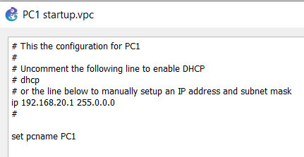
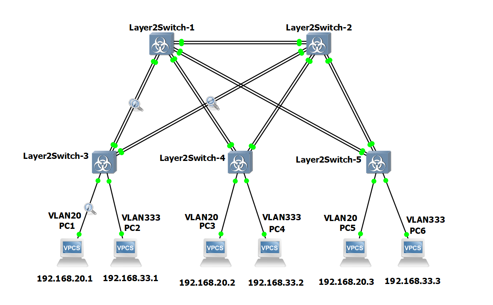
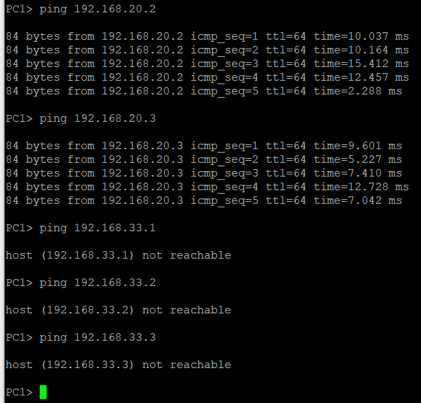
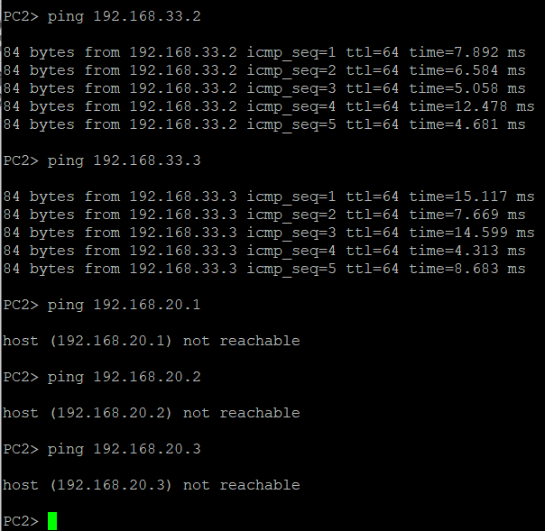
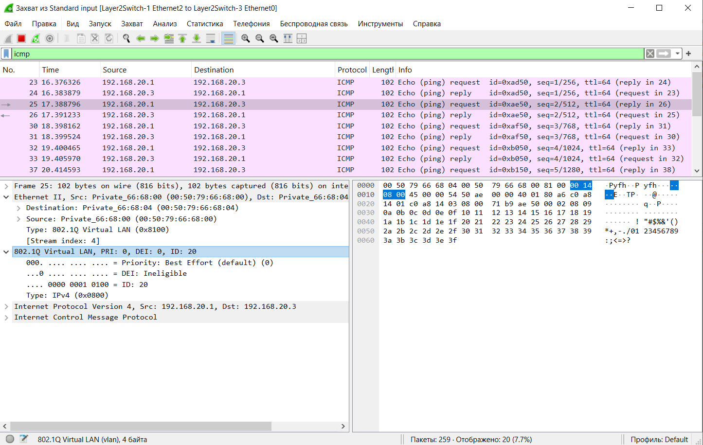
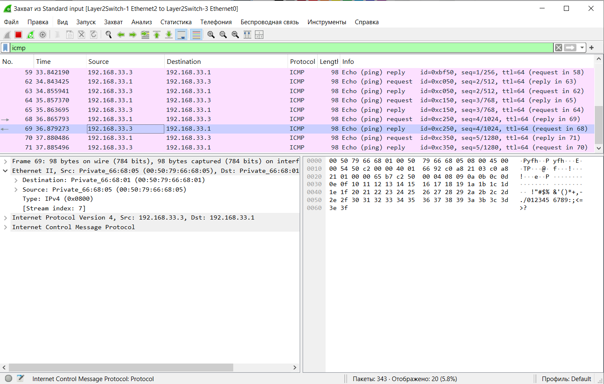
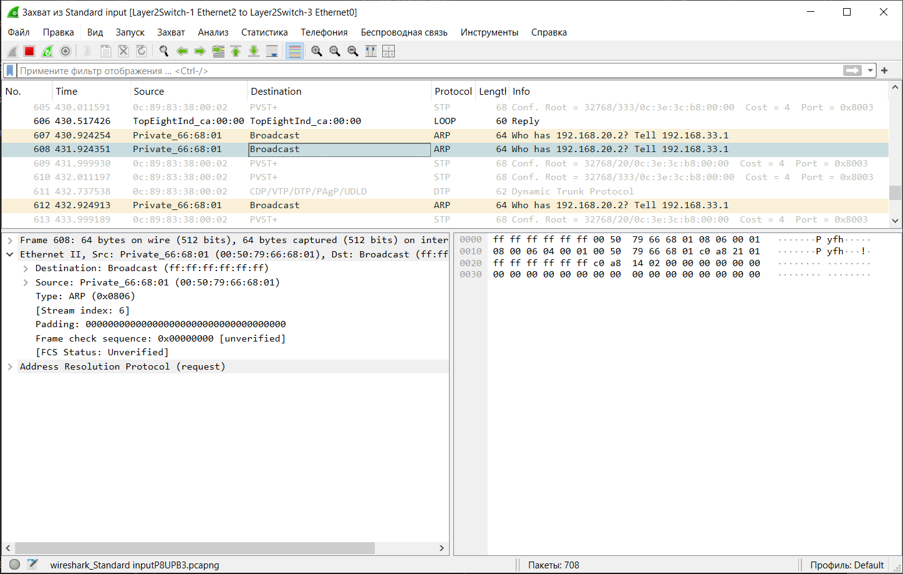

1) Для заданной на схеме schema-lab3 сети, состоящей из управляемых коммутаторов и персональных компьютеров
настроить на коммутаторах логическую топологию используя протокол IEEE 802.1Q, для передачи пакетов VLAN333 между
коммутаторами использовать Native VLAN

Так как на всех коммутаторах уже созданы VLAN с нужными номерами, создавать их снова не требуется.  
Зададим компьютерам ip адреса.

Access портами будут установлены порты, к которым присоединены компьютеры, все остальные будут установлены как trunk. STP решит проблему возможных петель. 

На коммутаторах 3, 4, 5:  
Switch#configure terminal  
Switch(config)#interface Gi1/0  
Switch(config-if)#switchport mode access  
Switch(config-if)#switchport access vlan 20  
Switch(config-if)#exit  
Switch(config)#interface Gi1/1  
Switch(config-if)#switchport mode access  
Switch(config-if)#switchport access vlan 333  

Switch#configure terminal  
Switch(config)#interface range Gi0/0-3  
Switch(config-if-range)#switchport trunk encapsulation dot1q #без этого mode trunk не устанавливается  
Switch(config-if-range)#switchport mode trunk  
Switch(config-if-range)#switchport trunk native vlan 333  
Switch(config-if-range)#switchport trunk allowed vlan 20,333  
Switch(config-if-range)#exit  
Switch(config)#exit  

На коммутаторах 1, 2:  

Switch#configure terminal  
Switch(config)#interface range Gi0/0-3, Gi1/0-3  
Switch(config-if-range)#switchport trunk encapsulation dot1q  
Switch(config-if-range)#switchport mode trunk  
Switch(config-if-range)#switchport trunk native vlan 333  
Switch(config-if-range)#switchport trunk allowed vlan 20,333  
Switch(config-if-range)#exit  
Switch(config)#exit  

Show run коммутаторов 1 и 2:

interface GigabitEthernet0/0  
 switchport trunk encapsulation dot1q  
 switchport trunk native vlan 333  
 switchport trunk allowed vlan 20,333  
 switchport mode trunk  
 media-type rj45  
 negotiation auto  
!  
interface GigabitEthernet0/1  
 switchport trunk encapsulation dot1q  
 switchport trunk native vlan 333  
 switchport trunk allowed vlan 20,333  
 switchport mode trunk  
 media-type rj45  
 negotiation auto  
!  
interface GigabitEthernet0/2  
 switchport trunk encapsulation dot1q  
 switchport trunk native vlan 333  
 switchport trunk allowed vlan 20,333  
 switchport mode trunk  
 media-type rj45  
 negotiation auto  
!  
interface GigabitEthernet0/3  
 switchport trunk encapsulation dot1q  
 switchport trunk native vlan 333  
 switchport trunk allowed vlan 20,333  
 switchport mode trunk  
 media-type rj45  
 negotiation auto  
!  
interface GigabitEthernet1/0  
 switchport trunk encapsulation dot1q  
 switchport trunk native vlan 333  
 switchport trunk allowed vlan 20,333  
 switchport mode trunk  
 media-type rj45  
 negotiation auto  
!  
interface GigabitEthernet1/1  
 switchport trunk encapsulation dot1q  
 switchport trunk native vlan 333  
 switchport trunk allowed vlan 20,333  
 switchport mode trunk  
 media-type rj45  
 negotiation auto  
!  
interface GigabitEthernet1/2  
 switchport trunk encapsulation dot1q  
 switchport trunk native vlan 333  
 switchport trunk allowed vlan 20,333  
 switchport mode trunk  
 media-type rj45  
 negotiation auto  
!  
interface GigabitEthernet1/3  
 switchport trunk encapsulation dot1q  
 switchport trunk native vlan 333  
 switchport trunk allowed vlan 20,333  
 switchport mode trunk  
 media-type rj45  
 negotiation auto  
!  

Show run коммутаторов 3, 4 и 5:  

interface GigabitEthernet0/0  
 switchport trunk encapsulation dot1q  
 switchport trunk native vlan 333  
 switchport trunk allowed vlan 20,333  
 switchport mode trunk  
 media-type rj45  
 negotiation auto  
!  
interface GigabitEthernet0/1  
 switchport trunk encapsulation dot1q  
 switchport trunk native vlan 333  
 switchport trunk allowed vlan 20,333  
 switchport mode trunk  
 media-type rj45  
 negotiation auto  
!  
interface GigabitEthernet0/2  
 switchport trunk encapsulation dot1q  
 switchport trunk native vlan 333  
 switchport trunk allowed vlan 20,333  
 switchport mode trunk  
 media-type rj45  
 negotiation auto  
!  
interface GigabitEthernet0/3  
 switchport trunk encapsulation dot1q  
 switchport trunk native vlan 333  
 switchport trunk allowed vlan 20,333  
 switchport mode trunk  
 media-type rj45  
 negotiation auto  
!  
interface GigabitEthernet1/0  
 switchport access vlan 20  
 media-type rj45  
 negotiation auto  
!  
interface GigabitEthernet1/1  
 switchport access vlan 333  
 media-type rj45  
 negotiation auto  
!  

2) Проверить доступность персональных компьютеров, находящихся в одинаковых VLAN и недоступность находящихся в различных, результаты задокументировать

C другими компьютерами ситуация аналогичная.

3) Перехватить в WireShark пакеты с тегами и без тегов (nb!), результаты задокументировать

Чтобы поймать пакет с тегами я производил пинг между устройствами VLAN 20, а чтобы поймать без тегов - VLAN 333. При попытке пинга между устройствами разных VLAN, пакет ICMP не создаётся, так как не получает ответного ARP пакета, хотя ARP пакет выходит и гуляет по сети, так и не попадая к хосту с нужным адресом.

4) Сохранить файлы конфигураций устройств в виде набора файлов с именами, соответствующими именам устройств

Сохранение файлов конфигураций происходило согласно инструкции.

Switch>enable  
Switch#term len 0  
Switch#sh run  
Switch#term len 25  
Switch#disable  
Switch>  