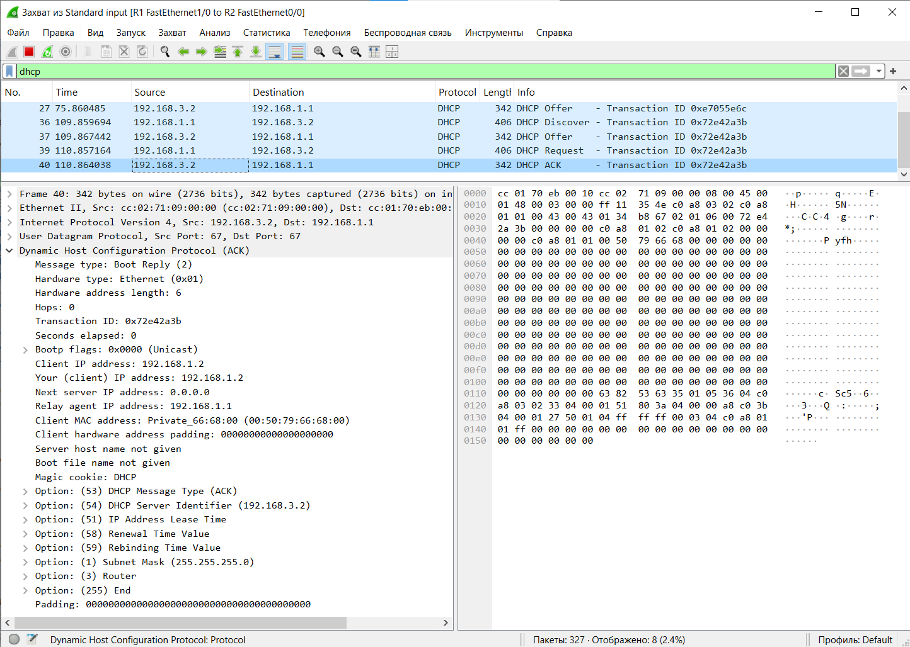

1) Для заданной на схеме schema-lab4 сети, состоящей из управляемых коммутаторов, маршрутизаторов и персональных компьютеров
выполнить планирование и документирование адресного пространства в подсетях LAN1, LAN2, LAN3 и назначить статические адреса маршрутизаторам 
и динамическое конфигурирование адресов для VPC

Адресное пространство подсетей LAN 1, 2, 3:

LAN1: 192.168.1.0/24  
LAN2: 192.168.2.0/24  
LAN3: 192.168.3.0/24  


Настройка маршрутизатора R2 в сети LAN 3:

```
R2#conf t
Enter configuration commands, one per line.  End with CNTL/Z.
R2(config)#interface f0/0
R2(config-if)#ip address 192.168.3.2 255.255.255.0
R2(config-if)#no sh
R2(config-if)#no shutdown
R2(config-if)#exit
R2(config)#
*Mar  1 00:01:08.179: %LINK-3-UPDOWN: Interface FastEthernet0/0, changed state to up
*Mar  1 00:01:09.179: %LINEPROTO-5-UPDOWN: Line protocol on Interface FastEthernet0/0, changed state to up
R2(config)#exit
R2#w
*Mar  1 00:01:12.255: %SYS-5-CONFIG_I: Configured from console by console
R2#write
Building configuration...
[OK]
R2#
```

Настройка маршрутизатора R1 в сетях LAN 1, 2, 3:

```
R1#conf t
Enter configuration commands, one per line.  End with CNTL/Z.
R1(config)#interface f0/0
R1(config-if)#ip ad
R1(config-if)#ip address 192.168.1.1 255.255.255.0
R1(config-if)#no shutdown
R1(config-if)#
*Mar  1 00:04:50.383: %LINK-3-UPDOWN: Interface FastEthernet0/0, changed state to up
*Mar  1 00:04:51.383: %LINEPROTO-5-UPDOWN: Line protocol on Interface FastEthernet0/0, changed state to up
R1(config-if)#exit
R1(config)#interface f1/0
R1(config-if)#ip ad
R1(config-if)#ip address 192.168.3.1 255.255.255.0
R1(config-if)#no shutdown
R1(config-if)#exit
R1(config)#
*Mar  1 00:05:31.451: %LINK-3-UPDOWN: Interface FastEthernet1/0, changed state to up
*Mar  1 00:05:32.451: %LINEPROTO-5-UPDOWN: Line protocol on Interface FastEthernet1/0, changed state to up
R1(config)#interface f2/0
R1(config-if)#ip
R1(config-if)#ip a
R1(config-if)#ip ad
R1(config-if)#ip address 192.168.2.1 255.255.255.0
R1(config-if)#no shutdown
R1(config-if)#exit
R1(config)#
*Mar  1 00:06:06.487: %LINK-3-UPDOWN: Interface FastEthernet2/0, changed state to up
*Mar  1 00:06:07.487: %LINEPROTO-5-UPDOWN: Line protocol on Interface FastEthernet2/0, changed state to up
R1(config)#exit

```

2) Настроить сервер DHCP на маршрутизаторе R2 для обслуживания адресных пулов адресного пространства подсетей LAN1 и LAN2

```
R2#conf t
Enter configuration commands, one per line.  End with CNTL/Z.
R2(config)#interface f0/0
R2(config-if)#ip dhcp pool LAN1
R2(dhcp-config)#network 192.168.1.0 255.255.255.0
R2(dhcp-config)#defa
R2(dhcp-config)#default-router 192.168.1.1
R2(dhcp-config)#exit
R2(config)#interface f0/0
R2(config-if)#ip dhcp pool LAN2
R2(dhcp-config)#network 192.168.2.0 255.255.255.0
R2(dhcp-config)#defa
R2(dhcp-config)#default-router 192.168.2.1
R2(dhcp-config)#exit

```

3) Настроить статическую (nb!) маршрутизацию между подсетями

На роутере 2:

```
R2#conf t
Enter configuration commands, one per line.  End with CNTL/Z.
R2(config)#ip route 192.168.1.0 255.255.255.0 192.168.3.1
R2(config)#ip route 192.168.2.0 255.255.255.0 192.168.3.1
R2(config)#exit
```

Т.к. DHCP сервер (Роутер 2) находится в подсети, которая отличается от подсети хостов, необходимо настроить DHCP Relay на роутере 1.

```
R1#conf t
Enter configuration commands, one per line.  End with CNTL/Z.
R1(config)#int f0/0
R1(config-if)#ip helper-address 192.168.3.2
R1(config-if)#exit
R1(config)#int f2/0
R1(config-if)#ip helper-address 192.168.3.2
R1(config-if)#exit
R1(config)#exit
```

Без relay:

```
PC1> show ip

NAME        : PC1[1]
IP/MASK     : 0.0.0.0/0
GATEWAY     : 0.0.0.0
DNS         :
MAC         : 00:50:79:66:68:00
LPORT       : 22620
RHOST:PORT  : 127.0.0.1:22621
MTU         : 1500

PC1> ip dhcp
DDD
Can't find dhcp server
```

С Relay:

```
PC1> ip dhcp
DDORA IP 192.168.1.2/24 GW 192.168.1.1

PC1>
PC1> show ip

NAME        : PC1[1]
IP/MASK     : 192.168.1.2/24
GATEWAY     : 192.168.1.1
DNS         :
DHCP SERVER : 192.168.3.2
DHCP LEASE  : 86363, 86400/43200/75600
MAC         : 00:50:79:66:68:00
LPORT       : 22620
RHOST:PORT  : 127.0.0.1:22621
MTU         : 1500
```

Получение ip на всех компьютерах:

```
PC1> ip dhcp
DDORA IP 192.168.1.2/24 GW 192.168.1.1

PC2> ip dhcp
DDORA IP 192.168.1.3/24 GW 192.168.1.1

PC3> ip dhcp
DDORA IP 192.168.2.2/24 GW 192.168.2.1

PC4> ip dhcp
DDORA IP 192.168.2.3/24 GW 192.168.2.1
```

4) Проверить работоспособность протокола DHCP и маршрутизации, выполнив ping между всеми VPC


5) Перехватить в wireshark диалог одного из VPC с сервером DHCP, разобрать с комментариями

- Discovery 


Запрос отправляется в широковещательном режиме (IP = 255.255.255.255).  
Message type = 1 (Request), IP адрес заполнен нулями, что говорит что клиенту его ещё не определили, MAC клиента указан. На разных линках один и тот же запрос можно распознать по Transaction ID, который будет использоваться и далее в ответах. После передачи запроса на первый роутер, у запроса появляются данные в поле Relay agent IP address. Также запрос перестаёт быть широковещательным, имеет отправителя (Роутер 1 = реле) и получателя (Роутер 2).
В опциях указано, что тип сообщения Discover.

- Offer


DHCP сервер посылает через реле ответ (на 192.168.1.1), а реле этот ответ посылает компьютеру, причём указывая предлагаемый логический адрес в качестве получателя.  
Message type = 2 (Reply), Your (client) IP address = 192.168.1.2 (предлагаемый IP), МАС клиента. В опциях есть маска подсети, IP DHCP сервера, время, на которое выдаётся IP (1 день), время, через которое присылать запрос на продление времени выдачи IP. Также указано, что тип сообщения Offer.

- Request


Тип сообщения 1 (Request), отправляется широковещательно, Client IP address равен предложенному ранее, Your (client) IP address равен нулям. В опциях указано что это Request, IP сервера и запрошенный IP.

- Acknowledgement



Тип сообщения 2 (Request), Client IP address и Your IP address равны предложенному ранее. Опции содержат тип сообщения (ACK), IP сервера, время выдачи и продления, маску подсети.

6) Сохранить файлы конфигураций устройств в виде набора файлов с именами, соответствующими именам устройств

Сохранены в папке configurations